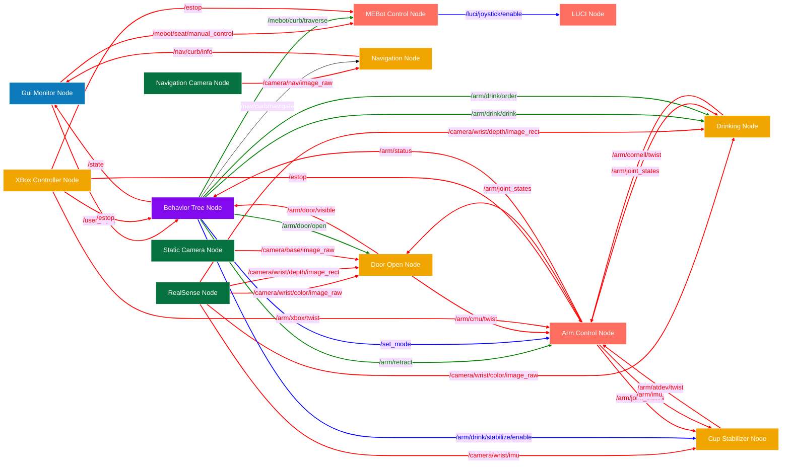

# ROS Node Specifications

This document defines the specification for all of the ROS nodes for the April 2026 RAMMP Prototype demo. The collection of specifications linked from this document should always reflect the full system architecture.

**NOTE: As you are developing, please ensure that any changes in you are making in the ROS specification are reflected in the docs below.**

## Node Specifications

Each of these links define the specification for the various nodes in the ROS network..

- [core/BehaviorTreeNode](./core/rammp_prototype_behavior/Behavior%20Tree%20Node.md)
- [core/GuiMonitorNode](./core/rammp_prototype_gui/GuiMonitorNode.md)
- [demo_modules/CupStabilizerNode](./demo_modules/atdev_coffee_stabilizer/Cup%20Stabilizer%20Node.md)
- [demo_modules/DoorOpenerNode](./demo_modules/cmu_door_opener/Door%20Open%20Node.md)
- [demo_modules/DrinkingNode](./demo_modules/cornell_feeding/Drinking%20Node.md)
- [demo_modules/NavigationNode](./demo_modules/neu_navigation/Navigation%20Node.md)
- [hardware/ArmControlNode](./hardware/arm_driver/Arm%20Control%20Node.md)
- [hardware/RammpPrototypeControlNode](./hardware/rammp_prototype_driver/MEBot%20Control%20Node.md)
- [hardware/XBoxControllerNode](./hardware/xbox_controller_driver/XBox%20Controller%20Node.md)

## ROS Node Diagram

These diagrams outline the topics, actions, and services for communication between all of the nodes.

```mermaid
%%{init: { 'theme': 'base',
'flowchart': { 'nodeSpacing': 50, 'rankSpacing': 100 },'themeVariables': { 'primaryTextColor':'white', 'primaryBorderColor':'#ffffff'}}}%%
graph RL
    subgraph legend[Diagram Legend]


        subgraph  arrows[Arrows]
        cm1[Communication Legend Node1]
        style cm1 fill:#000000
        cm2[Communication Legend Node2]
        style cm2 fill:#000000
        cm2 -->|/topic|cm1
        cm1 -->|/service| cm2
        cm1 -->|/action| cm2
        %% TOPIC connections (red)
        linkStyle 0 stroke:red,stroke-width:2px,color:red;

        %% SERVICE connections (yellow)
        linkStyle 1 stroke:blue,stroke-width:2px,color:blue;

        %% ACTION connections (green)
        linkStyle 2 stroke:green,stroke-width:2px,color:green;
        end
        subgraph Node[Node]
        Gui["Gui Nodes"]
        style Gui fill:#0c7aba
        style Gui width:230px,height:50px,text-anchor:middle
        Sensor["Sensor  Nodes"]
        style Sensor fill:#05723f
        style Sensor width:230px,height:50px,text-anchor:middle

        planning[Planning Nodes]
        style planning fill:#f0a500
        style planning width:230px,height:50px,display:flex,align-items:center,justify-content:center

        control[Control/Actuator Nodes]
        style control fill:#ff6f61
        style control width:230px,height:50px

        state[State Control Node]
        style state fill:#8309ef
        style state width:230px,height:50px
        end
    end

```

