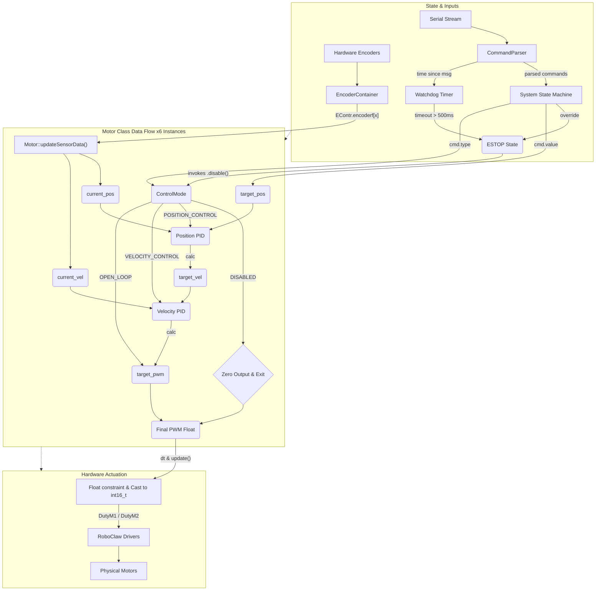

```mermaid
flowchart TD
    %% Define Subgraphs
    subgraph Communication ["State & Inputs"]
        SerialRx[Serial Stream] --> parser[CommandParser]
        parser -- parsed commands --> StateMachine[System State Machine]
        parser -- time since msg --> Watchdog[Watchdog Timer]
        Watchdog -- timeout > 500ms --> ESTOP(ESTOP State)
        StateMachine -- override --> ESTOP
        
        Encoders[Hardware Encoders] --> EContr[EncoderContainer]
    end

    subgraph Motor_Architecture ["Motor Class Data Flow x6 Instances"]
        direction TB
        EContr -- "EContr.encoderf[x]" --> MotorData["Motor::updateSensorData()"]
        MotorData --> currPos("current_pos")
        MotorData --> currVel("current_vel")
        
        StateMachine -- "cmd.value" --> tPos("target_pos")
        StateMachine -- "cmd.type" --> cMode("ControlMode")
        
        cMode -- DISABLED --> zero{"Zero Output & Exit"}

        tPos --> PosPID
        currPos --> PosPID
        PosPID("Position PID") -- calc --> tVel("target_vel")
        
        tVel --> VelPID
        currVel --> VelPID
        VelPID("Velocity PID") -- calc --> tPWM("target_pwm")
        
        cMode -- POSITION_CONTROL --> PosPID
        cMode -- VELOCITY_CONTROL --> VelPID
        cMode -- OPEN_LOOP --> tPWM
        
        zero --> outPWM("Final PWM Float")
        tPWM --> outPWM
    end

    subgraph Hardware_Output ["Hardware Actuation"]
        outPWM -- "dt & update()" --> Constrain["Float constraint & Cast to int16_t"]
        ESTOP -- "invokes .disable()" --> cMode
        Constrain -- "DutyM1 / DutyM2" --> RoboClaw[RoboClaw Drivers]
        RoboClaw --> Actuators[Physical Motors]
    end

    %% Wiring subgraphs
    Communication -.-> Motor_Architecture
    Motor_Architecture -.-> Hardware_Output
```
