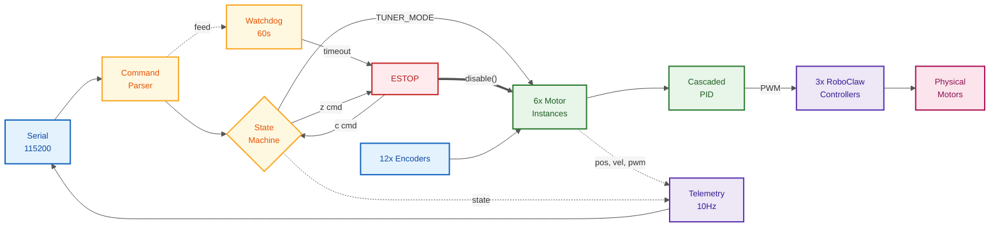
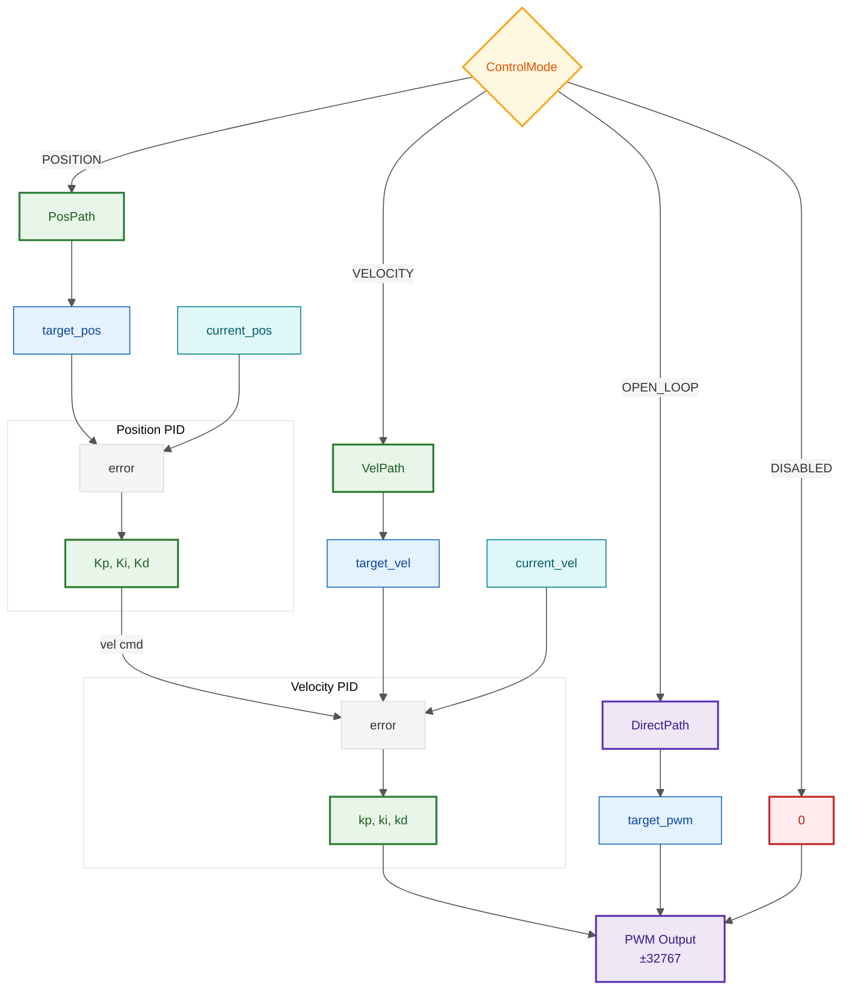
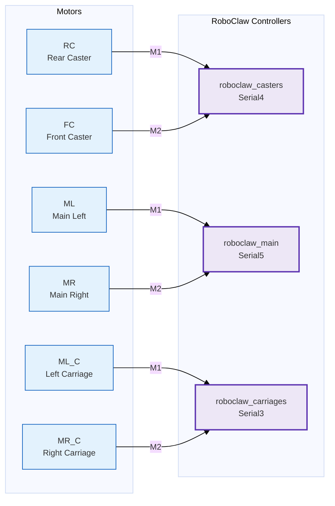

# Motor Control Data Flow

## System Overview

High-level view of data flow through the MEBot/RAMMP motor control system.

---

## Cascaded PID Control

Detail view of the control loop inside each Motor instance. Position control cascades into velocity control.

---

## Hardware Mapping

### Motor → RoboClaw Wiring

### Encoder → Motor Mapping

| Motor | ID | Encoder Index | Description |
|-------|:--:|:-------------:|-------------|
| RC | 0 | `encoderf[3]` | Rear Caster |
| FC | 1 | `encoderf[2]` | Front Caster |
| ML | 2 | `encoderf[7]` | Main Left Wheel |
| MR | 3 | `encoderf[5]` | Main Right Wheel |
| ML_C | 4 | `encoderf[11]` | Left Carriage |
| MR_C | 5 | `encoderf[12]` | Right Carriage |

> **Note**: Encoder indices may need verification against physical wiring.
