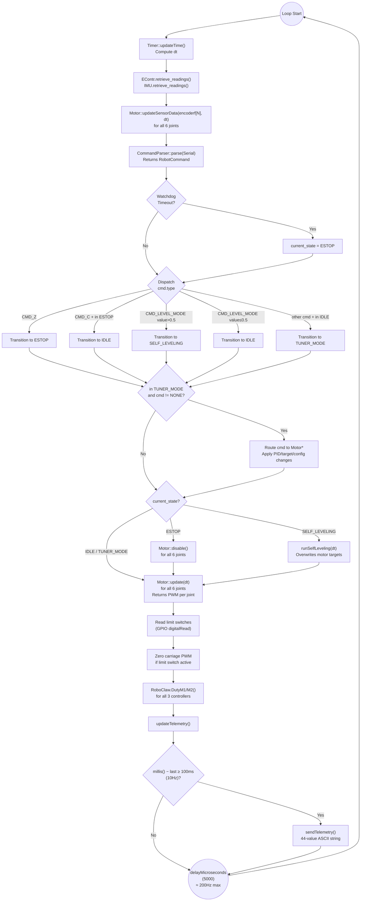

# Firmware Architecture

The firmware is designed around a single, tight, non-blocking `loop()` function in `Base.ino`.

## `Base.ino` File Structure

`Base.ino` is 796 lines and contains all global state and the top-level orchestration logic. Complex subsystem logic is delegated to the classes in `src/`.

| Lines | Section | Description |
|---|---|---|
| 1–16 | Includes | Arduino core, all `src/` headers, SD/SPI/Wire libraries |
| 17 | `DEBUG_MODE` | `#define DEBUG_MODE 1` — enables verbose `Serial.print` debug output on every command received and state transition. Set to `0` for production. |
| 20–28 | `SystemState` enum | Defines the 7 firmware states |
| 31–40 | `SystemTelemetry` struct | Convenience struct for grouping telemetry fields before serialization |
| 42–78 | Global Objects | `IMU`, `EContr`, `timer`, `parser`, RoboClaw instances, 6 `Motor` instances, limit switch booleans |
| 83–98 | `updateTelemetry()` | Copies motor and IMU state into the `SystemTelemetry` struct |
| 101–203 | `sendTelemetry()` | 44 consecutive `Serial.print()` calls; emits the telemetry packet |
| 207–312 | `runSelfLeveling()` | Quaternion error → rotation matrix → chassis geometry → joint targets |
| 314–383 | `setup()` | Hardware init, IMU init, EEPROM load, encoder offset restore |
| 385–796 | `loop()` | Main 5ms control loop |

---

## The Main Loop Flow



---

## Modular Directory (`src/`)

To keep `Base.ino` readable, complex logic is encapsulated in object-oriented C++ classes:

| Class | File | Responsibility | Deep Docs |
|---|---|---|---|
| `Motor` | `src/Motor/` | Cascaded PID loops, software position limits, direction abstraction, PWM scaling | [Motor Control & PID](MOTOR_CONTROL.md) |
| `PIDController` | `src/PIDController/` | Generic PID with feed-forward, conditional anti-windup, output LPF | [PID Controller](PID_CONTROLLER.md) |
| `CommandParser` | `src/CommandParser/` | Non-blocking byte accumulation, command parsing, watchdog timer | [Command Reference](COMMAND_REFERENCE.md) |
| `IMU_Class` | `src/IMU_Class/` | BNO055 wrapper, quaternion→Euler conversion, upside-down mount correction, swing decomposition | [IMU Layer](IMU_LAYER.md) |
| `EncoderContainer` | `src/EncoderContainer/` | 12-encoder hardware read, offset-based zeroing, IIR filter | [Encoder Layer](ENCODER_LAYER.md) |
| `ConfigStorage` | `src/ConfigStorage/` | EEPROM read/write for `MotorConfig` structs, magic-number validity check | [Config Storage](../shared/CONFIG_STORAGE.md) |
| `Timer` | `src/Timer/` | `millis()`-based `dt` computation — see below | — |
| `RoboClaw` | `src/RoboClaw/` | Third-party driver library for BasicMicro RoboClaw motor controllers | — |

### `Timer` Class

The `Timer` class (`src/Timer/Timer.h`, `src/Timer/Timer.cpp`) is minimal. It calls `millis()` each loop and computes `elapsed_time` (the `dt` used by all PID controllers):

```cpp
class Timer {
public:
    float current_time, elapsed_time, previous_time;
    void updateTime();
};
```

`updateTime()` sets `elapsed_time = (current_time - previous_time) / 1000.0f` (converting ms to seconds). This `dt` value is passed to every `Motor::update()` and `PIDController::compute()` call. Having a single consistent `dt` per loop ensures all PID integrators and velocity differentiators agree on the time step.

---

## Boot Sequence (`setup()`) — Lines 314–383

The `setup()` function performs the following in order:

1. **Serial initialization** (Lines 315–318): All 4 serial ports at 460800 baud — `Serial` for Jetson/USB, `Serial3/4/5` for the three RoboClaws.

2. **Limit switch pin configuration** (Lines 320–324): `INPUT_PULLUP` mode for all 4 carriage limit switch pins.

3. **1-second delay** (Line 326): Allows hardware (especially the IMU) time to power-stabilize before initialization.

4. **IMU initialization** (Lines 328–334): `bno.begin()` over I²C. On failure, prints an error to Serial — but importantly, **does not halt** (unlike `IMU_Class::initialize_BNO055_sensor()` which blocks). The IMU being unavailable is recoverable — the system will operate but self-leveling will produce incorrect outputs.

5. **EEPROM load** (Lines 336–380): `ConfigStorage::begin()` validates the EEPROM magic number and initializes defaults if uninitialized. Then for each of the 6 motors:
   - Loads all `MotorConfig` fields (PID gains, directions, LPF alphas, limits)
   - Applies direction, encoder direction, and all PID parameters to the `Motor` instance
   - **Restores encoder offset** so `encoderf[N]` resumes from the last saved logical position. The math at Line 377: `encoder_offset[enc_idx] = raw_reading - (saved_position / encoder_dir)` ensures that `(raw_reading - offset) × encoder_dir == saved_position` on the first `retrieve_readings()` call.

6. **State transition to `IDLE`** (Line 382): Boot complete.

---

## Timing and Loop Rate

The loop is paced by `delayMicroseconds(5000)` at the end of `loop()` (Line 795), targeting a 200Hz cycle rate. In practice, the sensor reads, PID computations, and serial I/O add overhead, so actual loop rate is lower — roughly 100–200Hz depending on serial activity.

The telemetry packet is limited to **10Hz** by a `millis()` timer rather than running every loop, to avoid flooding the serial buffer and to give the host PC adequate time to process each packet.
