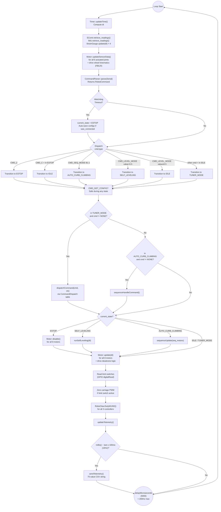

# Firmware Architecture

The firmware is designed around a single, tight, non-blocking `loop()` function in `Base.ino`.

## `Base.ino` File Structure

`Base.ino` is 748 lines and contains all global state, motor/sensor object instantiation, the self-leveling kinematics, and the top-level orchestration logic. Complex subsystem logic is delegated to the classes in `src/`.

| Lines     | Section                       | Description                                                                                                                                     |
| --------- | ----------------------------- | ----------------------------------------------------------------------------------------------------------------------------------------------- |
| 1–24      | Includes                      | Arduino core, all `src/` headers, SD/SPI/Wire libraries                                                                                         |
| 25        | `DEBUG_MODE`                  | `#define DEBUG_MODE 1` — enables verbose `Serial.print` debug output on every command received and state transition. Set to `0` for production. |
| 31        | `DRIVE_DEADZONE_TICKS`        | `300.0f` — drive motor position deadzone to prevent joystick creep                                                                              |
| 37–38     | Global State                  | `current_state`, `telemetry` — SystemState enum and SystemTelemetry struct (defined in `src/Telemetry/Telemetry.h`)                             |
| 42–44     | Self-Leveling Targets         | `target_pitch`, `target_roll` globals (degrees)                                                                                                |
| 46–96     | Hardware Objects               | IMU, EContr, timer, parser (60s timeout), RoboClaw instances (3), 8 Motor instances, limit switches, strain gauges                             |
| 80–90     | `motor_map[8]`                | Centralized motor-encoder-RoboClaw mapping table (defined here, declared in `src/MotorMap/MotorMap.h`)                                         |
| 105–318   | `runSelfLeveling(dt)`         | Quaternion error → FK offset → rotation matrix → chassis geometry → blended joint targets                                                       |
| 320–388   | `saveAllMotorConfigs()` / `saveMotorConfig()` | EEPROM write helpers for all 8 motors                                                                                           |
| 391–475   | `setup()`                     | Hardware init, IMU init, EEPROM load, encoder offset restore for 8 motors                                                                      |
| 477–748   | `loop()`                      | Main 5ms control loop                                                                                                                           |

______________________________________________________________________

## The Main Loop Flow



______________________________________________________________________

## Modular Directory (`src/`)

To keep `Base.ino` readable, complex logic is encapsulated in object-oriented C++ classes:

| Class              | File                      | Responsibility                                                                                 | Deep Docs                                     |
| ------------------ | ------------------------- | ---------------------------------------------------------------------------------------------- | --------------------------------------------- |
| `Motor`            | `src/Motor/`              | Cascaded PID loops, software position limits, direction abstraction, PWM scaling               | [Motor Control & PID](MOTOR_CONTROL.md)       |
| `PIDController`    | `src/PIDController/`      | Generic PID with feed-forward, conditional anti-windup, output LPF                             | [PID Controller](PID_CONTROLLER.md)           |
| `CommandParser`    | `src/CommandParser/`      | Non-blocking byte accumulation, command parsing, watchdog timer                                | [Command Reference](COMMAND_REFERENCE.md)     |
| `CommandDispatch`  | `src/CommandDispatch/`    | Table-driven command handler dispatch for TUNER_MODE commands                                  | [Command Reference](COMMAND_REFERENCE.md)     |
| `MotorMap`         | `src/MotorMap/`           | Centralized motor-encoder-RoboClaw mapping table (`motor_map[8]`, `getMotor()`, `getEncoderIndex()`) | —                                        |
| `Telemetry`        | `src/Telemetry/`          | `SystemState` enum, `SystemTelemetry` struct, `updateTelemetry()`, `sendTelemetry()`           | [Telemetry](TELEMETRY.md)                     |
| `SequencePlayer`   | `src/SequencePlayer/`     | Keyframe-based sequence playback for AUTO_CURB_CLIMBING (interpolation, settling, auto-run)    | —                                             |
| `IMU_Class`        | `src/IMU_Class/`          | BNO055 wrapper, quaternion→Euler conversion, upside-down mount correction, swing decomposition | [IMU Layer](IMU_LAYER.md)                     |
| `EncoderContainer` | `src/EncoderContainer/`   | 12-encoder hardware read, offset-based zeroing, IIR filter                                     | [Encoder Layer](ENCODER_LAYER.md)             |
| `StrainGauge`      | `src/StrainGauge/`        | Load-cell ADC wrapper with IIR low-pass filter                                                 | —                                             |
| `ConfigStorage`    | `src/ConfigStorage/`      | EEPROM read/write for 8 `MotorConfig` structs, magic-number validity check                     | [Config Storage](../shared/CONFIG_STORAGE.md) |
| `Timer`            | `src/Timer/`              | `millis()`-based `dt` computation — see below                                                  | —                                             |
| `RoboClaw`         | `src/RoboClaw/`           | Third-party driver library for BasicMicro RoboClaw motor controllers                           | —                                             |

### `Timer` Class

The `Timer` class (`src/Timer/Timer.h`, `src/Timer/Timer.cpp`) is minimal. It calls `millis()` each loop and computes `elapsed_time` (the `dt` used by all PID controllers):

```cpp
class Timer {
public:
    float current_time, elapsed_time, previous_time;
    void updateTime();
};
```

`updateTime()` sets `elapsed_time = (current_time - previous_time) / 1000.0f` (converting ms to seconds). This `dt` value is passed to every `Motor::update()` and `PIDController::compute()` call. Having a single consistent `dt` per loop ensures all PID integrators and velocity differentiators agree on the time step.

### `MotorMap` — Centralized Motor Mapping

The `MotorMap` module (`src/MotorMap/MotorMap.h`) replaces the duplicated switch statements that previously mapped motor IDs to encoder indices. Each of the 8 motors is represented as a `MotorEntry`:

```cpp
struct MotorEntry {
  Motor* motor;              // Pointer to global Motor object
  uint8_t encoder_index;     // Encoder array index in EncoderContainer
  RoboClaw* controller;      // RoboClaw instance (nullptr for drive wheels)
  uint8_t roboclaw_channel;  // 1=M1, 2=M2, 0=no controller
  bool supports_offset;      // true for motors 1-6, false for drive wheels
  bool in_sequence;          // true for motors participating in AUTO_CURB_CLIMBING
  const char* name;          // Human-readable name for debug
};
```

The actual `motor_map[8]` array is populated in `Base.ino` lines 81–90. See [Joint Mapping](../shared/JOINT_MAPPING.md) for the full table.

______________________________________________________________________

## Boot Sequence (`setup()`) — Lines 391–475

The `setup()` function performs the following in order:

1. **Serial initialization** (Lines 392–395): All 4 serial ports at 460800 baud — `Serial` for Jetson/USB, `Serial3/4/5` for the three RoboClaws.

1. **Limit switch pin configuration** (Lines 398–401): `INPUT_PULLUP` mode for all 4 carriage limit switch pins.

1. **1-second delay** (Line 403): Allows hardware (especially the IMU) time to power-stabilize before initialization.

1. **IMU initialization** (Lines 406–411): `bno.begin()` over I²C. On failure, prints an error to Serial — but importantly, **does not halt**. The IMU being unavailable is recoverable — the system will operate but self-leveling will produce incorrect outputs. On success, calls `IMU.initialize_BNO055_sensor()`.

1. **EEPROM load** (Lines 414–464): `ConfigStorage::begin()` validates the EEPROM magic number and initializes defaults if uninitialized. Then for each of the **8 motors**:

   - Loads all `MotorConfig` fields (PID gains, directions, LPF alphas, limits, ramp rates)
   - Sanitizes NaN/Inf values to 0.0 via a lambda guard
   - Applies direction, encoder direction, and all PID parameters to the `Motor` instance
   - For drive wheel motors (IDs 7 and 8), restores `ml_enc_dir` / `mr_enc_dir` globals from EEPROM
   - **Restores encoder offset** so `encoderf[N]` resumes from the last saved logical position. The math at Line 460: `encoder_offset[enc_idx] = raw_reading - (saved_position / encoder_dir)` ensures that `(raw_reading - offset) × encoder_dir == saved_position` on the first `retrieve_readings()` call.

1. **Drive wheel direction reset** (Lines 469–470): Drive wheel motor objects are forced to `encoder_dir = 1` — the actual direction correction is handled externally via `ml_enc_dir` / `mr_enc_dir`.

1. **State transition to `IDLE`** (Line 474): Boot complete.

______________________________________________________________________

## Timing and Loop Rate

The loop is paced by `delayMicroseconds(5000)` at the end of `loop()` (Line 747), targeting a 200Hz cycle rate. In practice, the sensor reads, PID computations, and serial I/O add overhead, so actual loop rate is lower — roughly 100–200Hz depending on serial activity.

The telemetry packet is limited to **10Hz** by a `millis()` timer (Lines 740–744) rather than running every loop, to avoid flooding the serial buffer and to give the host PC adequate time to process each packet.
