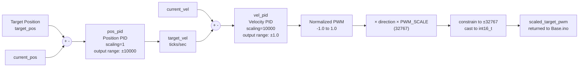

# Motor Control & PID

The `Motor` class (`src/Motor/Motor.h`, `src/Motor/Motor.cpp`) is the core abstraction for moving the robot's physical joints. Six `Motor` instances exist globally in `Base.ino`: `rc`, `fc`, `ml`, `mr`, `ml_carriage`, `mr_carriage`.

```
src/Motor/
├── Motor.h   (73 lines)  — Public interface, member declarations
└── Motor.cpp (128 lines) — Mode dispatch, sensor update, PID execution, PWM scaling
```

---

## Control Modes

Each `Motor` has a `ControlMode` enum (`Motor.h:9`) that determines what `update(dt)` computes:

| Mode | Value | Description |
|---|---|---|
| `DISABLED` | 0 | Motor is off. `update()` returns `0` immediately. All targets are zeroed. |
| `OPEN_LOOP` | 1 | Target PWM is written directly. No PID computation. |
| `VELOCITY_CONTROL` | 2 | Velocity PID computes PWM from `target_vel` and `current_vel`. |
| `POSITION_CONTROL` | 3 | Position PID computes `target_vel` from position error; Velocity PID then computes PWM. |

Mode changes are issued via the `M<id>:<mode>` serial command or internally by `runSelfLeveling()`. **Whenever the mode changes, both PID controllers are reset** (`Motor::setMode()`, `Motor.cpp:19-25`) to prevent stale integrator and filter state from causing a sudden output spike.

---

## Cascaded PID Architecture

When in `POSITION_CONTROL`, the two PID controllers execute in a cascade — the output of one feeds the input of the next:



1. **Outer Loop (Position):** Computes `target_vel = pos_pid.compute(target_pos, current_pos, dt)`. Output range is `[-10000, 10000]` representing a target velocity in encoder ticks/second.
2. **Inner Loop (Velocity):** Computes a normalized PWM fraction: `target_pwm = vel_pid.compute(target_vel, current_vel, dt)`. Output is `[-1.0, 1.0]` due to the `10000` scaling factor.
3. **Output Scaling:** The normalized PWM is multiplied by the motor direction (`±1`) and `PWM_SCALE = 32767`, then constrained and cast to `int16_t`.

The `VELOCITY_CONTROL` mode enters the cascade at step 2, skipping the position loop entirely.

For the detailed PID algorithm (anti-windup, output LPF, feed-forward, scaling divisor), see [PID Controller](PID_CONTROLLER.md).

---

## `Motor::update(dt)` — The Fallthrough Pattern (Lines 93–127)

The `switch` statement in `update()` uses intentional **case fallthrough** to avoid code duplication:

```cpp
switch (mode) {
case DISABLED:
    target_pwm = 0.0f;
    return 0.0f;                       // <-- exits here

case POSITION_CONTROL:
    target_vel = pos_pid.compute(...); // <-- computes target_vel, then falls through
    // FALLTHROUGH

case VELOCITY_CONTROL:
    target_pwm = vel_pid.compute(...); // <-- computes target_pwm, then falls through
    // FALLTHROUGH

case OPEN_LOOP:
default:
    // Soft position limits + direction scaling + constrain
    return scaled_target_pwm;
}
```

`POSITION_CONTROL` computes a `target_vel` and falls into `VELOCITY_CONTROL`, which computes `target_pwm` and falls into `OPEN_LOOP`, which applies the final scaling. Each mode "adds" its computation to the chain and reuses the code below it.

---

## Software Position Limits (Lines 114–121)

Separate from the hardware limit switches (which are read in `Base.ino` and apply to carriage motors only), every `Motor` has a software position enforcement inside `update()`:

```cpp
if (limits_enabled) {
    if (current_pos <= pos_limit_min && target_pwm < 0) {
        target_pwm = 0.0f;
    } else if (current_pos >= pos_limit_max && target_pwm > 0) {
        target_pwm = 0.0f;
    }
}
```

`limits_enabled` is `true` when `pos_limit_min != pos_limit_max` (set by `updateLimits()`). The limit only prevents motion **into** the wall — the motor can still back away. This prevents hard mechanical damage if the PID drives past the intended range.

Set via commands `n<id>:<min>` and `x<id>:<max>`, or persisted to EEPROM with `K<id>`.

---

## `disable()` — Safe Power-Off (Lines 27–34)

Called on every `Motor` instance when the system enters `ESTOP`.

```cpp
void Motor::disable() {
    target_pwm = 0.0f;
    target_vel = 0.0f;
    target_pos = current_pos;  // Prevent position jump when re-enabling
    pos_pid.reset();           // Clear integrator and LPF state
    vel_pid.reset();
    setMode(DISABLED);
}
```

Setting `target_pos = current_pos` is a critical safety detail. When ESTOP is cleared and the motor re-enables in `POSITION_CONTROL`, the position error will be exactly zero, so the motor will not lunge toward the last commanded position from before the ESTOP.

---

## Sensor Update — `updateSensorData()` (Lines 78–91)

Called each `loop()` cycle before `update()`, feeding the latest encoder reading:

```cpp
void Motor::updateSensorData(float current_pos, float dt) {
    float raw_pos = current_pos * encoder_dir;  // Apply encoder direction inversion

    // Position IIR filter
    this->current_pos += lpf_input_alpha * (raw_pos - this->current_pos);

    // Velocity derived from positional delta
    if (dt > 0.0f) {
        float raw_vel = (this->current_pos - this->prev_pos) / dt;
        this->current_vel += lpf_input_alpha * (raw_vel - this->current_vel);
    }
    this->prev_pos = this->current_pos;
}
```

Velocity is numerically differentiated from filtered position, then the same IIR filter is applied again. Using filtered position to compute velocity prevents noise in the raw encoder signal from producing a noisy derivative.

`lpf_input_alpha` (default `0.5`, range `0–1`) controls how aggressively this input filter smooths the position and velocity signals. Higher values track faster but pass more noise; lower values are smoother but add phase lag to the feedback.

---

## Direction Multipliers

Two independent direction controls exist per motor:

| Member | Applies To | Effect |
|---|---|---|
| `encoder_dir` (+1/-1) | `updateSensorData()` input | Flips the logical sign of the encoder position. Corrects for encoders wired in reverse without re-wiring. |
| `direction` (+1/-1) | `update()` final output | Flips the PWM sign sent to the RoboClaw. Corrects for motors wired in reverse without re-wiring. |

These are independent so that the encoder and motor can be reversed separately. Both are persistent across reboots via EEPROM.

Toggle via `V<id>` (motor direction) and `E<id>` (encoder direction) commands.

---

## Hardware Limit Switches (in `Base.ino`)

The hardware limit switches on the carriage motors are handled in `Base.ino:730-750`, **after** `Motor::update()` returns a PWM value but **before** it is written to the RoboClaw:

```cpp
ml_fwd_limit = !digitalRead(CARRIAGE_SW1_PIN);  // Active-low switches
ml_bwd_limit = !digitalRead(CARRIAGE_SW2_PIN);

if (ml_fwd_limit && mlc_pwm > 0) mlc_pwm = 0;  // Stop driving into forward limit
if (ml_bwd_limit && mlc_pwm < 0) mlc_pwm = 0;  // Stop driving into backward limit
```

This overrides any PWM computed by the PID, nulling it at the last moment. Like the software limits, this only prevents motion into the limit — the motor can still back away. The 4 limit switch states (`ml_fwd`, `ml_bwd`, `mr_fwd`, `mr_bwd`) are also included in the telemetry packet.

Pin assignments are in `Constants.h`:

| Switch | Pin | Joint | Direction |
|---|---|---|---|
| `CARRIAGE_SW1_PIN` | 23 | ML Carriage | Forward limit |
| `CARRIAGE_SW2_PIN` | 22 | ML Carriage | Backward limit |
| `CARRIAGE_SW3_PIN` | 13 | MR Carriage | Forward limit |
| `CARRIAGE_SW4_PIN` | 33 | MR Carriage | Backward limit |

---

## RoboClaw Dispatch (in `Base.ino`)

After all PWM values are computed and limit-checked, they are written to the three RoboClaw motor controllers (Lines 752–783):

| RoboClaw Instance | Serial Port | M1 | M2 |
|---|---|---|---|
| `roboclaw_main` | `Serial5` | `ml` (Main Left) | `mr` (Main Right) |
| `roboclaw_casters` | `Serial4` | `rc` (Rear Caster) | `fc` (Front Caster) |
| `roboclaw_carriages` | `Serial3` | `ml_carriage` | `mr_carriage` |

The PWM values are passed directly as `int16_t` to `DutyM1()` / `DutyM2()`, which accepts values in the range `[-32767, 32767]`. The `PWM_SCALE = 32767` constant in `Motor` maps the internal `[-1.0, 1.0]` normalized range to this hardware range.
