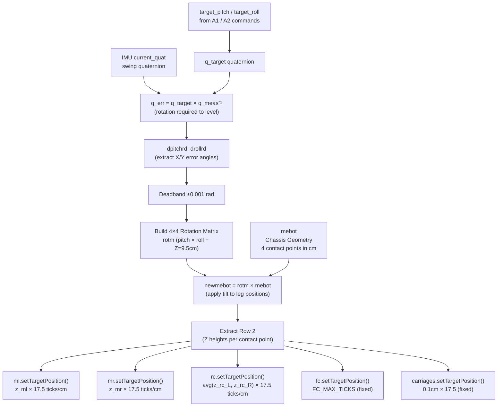

# Self-Leveling Kinematics

The `runSelfLeveling(float dt)` function in `Base.ino` (Lines 207–312) implements the closed-loop kinematics that keeps the robot chassis horizontal against an inclined surface. It is invoked each `loop()` cycle when the system is in the `SELF_LEVELING` state.

The algorithm takes the current IMU orientation, computes the angular error to a configurable target (pitch/roll), builds a 3D rotation matrix representing that error, applies it to the robot's chassis geometry, and dispatches the resulting leg height targets to the motor controllers.

---

## Overview: What It Solves

The MEBot has independently height-adjustable legs. When the robot is on a slope, these legs can be extended or retracted differentially to keep the chassis parallel to the ground (or any other target orientation). Self-leveling converts an angular orientation error into a set of target encoder positions for 5 of the 6 joints.

---

## Step 1 — IMU Error Quaternion (Lines 216–245)

### Getting the Measured Orientation

```cpp
imu::Quaternion q_meas = IMU.current_quat;
```

`current_quat` is the **swing quaternion** — yaw has been removed by `IMU_Class::extractSwing()`. This ensures the self-leveling controller only responds to tilt, not to the robot rotating in place. See [IMU Layer](IMU_LAYER.md) for details on swing decomposition.

### Building the Target Quaternion

The target orientation is stored as two float globals, `target_pitch` and `target_roll` (degrees), updated by the `A1` and `A2` commands. A target of `pitch=0, roll=0` means perfectly level.

Because the IMU is mounted upside down, the BNO055's Roll axis has a +180° physical offset (handled in software by `IMU_Class`). The target quaternion must encode this same offset to keep the coordinate frames consistent:

```cpp
double p_rad = (target_pitch * PI / 180.0) / 2.0;
imu::Quaternion q_target_pitch(cos(p_rad), sin(p_rad), 0.0, 0.0);

double r_rad = ((target_roll - 180.0) * PI / 180.0) / 2.0;  // -180° offset
imu::Quaternion q_target_roll(cos(r_rad), 0.0, sin(r_rad), 0.0);

imu::Quaternion q_target = q_target_pitch * q_target_roll;
```

The `/2.0` is the standard half-angle convention for quaternion construction.

### Computing the Error Quaternion

```cpp
imu::Quaternion q_err = q_target * q_meas.conjugate();
```

`q_meas.conjugate()` is the quaternion inverse (since it is unit-length). Multiplying `q_target` by the inverse of `q_meas` gives the **rotation required** to go from the current orientation to the target orientation.

### Extracting Pitch and Roll Error Angles (Lines 236–245)

The error quaternion is converted back to pitch and roll angles using the same aerospace Euler decomposition as the IMU class:

```cpp
double err_x = atan2(sinr_cosp, cosr_cosp) * (180.0 / PI); // Roll error
double err_y = asin(sinp) * (180.0 / PI);                  // Pitch error
```

Converting to radians and applying a deadband:

```cpp
float dpitchrd = 1.0f * (err_x / DG);  // DG = 180/π, converts degrees to radians
float drollrd  = 1.0f * (err_y / DG);

if (fabs(dpitchrd) < 0.001) dpitchrd = 0.0;
if (fabs(drollrd)  < 0.001) drollrd  = 0.0;
```

The deadband (~0.057°) prevents jitter when the error is near zero and would otherwise produce tiny oscillating PWM commands.

**Why use quaternions instead of working directly in Euler angles?**
Using the quaternion error decomposition avoids the ±180° wraparound problem. If `q_meas` is at 175° Roll and `target_roll` is -175°, the Euler difference would be ±350° but the quaternion approach correctly returns a ±10° rotation — no discontinuity.

---

## Step 2 — Rotation Matrix Construction (Lines 255–275)

The pitch and roll error angles are composed into a standard 4×4 homogeneous rotation matrix. This is a combined Rotation_X (pitch) and Rotation_Y (roll) matrix:

```
        ┌ cos(p)          0      sin(p)     0 ┐
rotm =  │ sin(r)·sin(p)  cos(r) -sin(r)·cos(p) 0 │
        │ -cos(r)·sin(p)  sin(r)  cos(r)·cos(p) Z │
        └ 0               0       0             1 ┘
```

Where `p = dpitchrd`, `r = drollrd`, and `Z = 9.5` (the baseline chassis height above ground in centimeters, `rotm[2][3]`).

The 4th row and column are the homogeneous convention — they allow the rotation and translation (Z height) to be combined in one matrix multiply.

**Why hardcode Z = 9.5 cm?** This is the nominal Z height of the chassis contact points above the ground when the legs are at their neutral extension. This offset ensures the leg height targets computed by the matrix are absolute heights from ground, not pure rotational displacements.

---

## Step 3 — Chassis Geometry Matrix (Lines 278–284)

The `mebot` matrix encodes the physical (X, Y) positions of the four leg contact points relative to the chassis center, in centimeters:

```cpp
double mebot[4][4] = {
    {-34, 34,  34, -34},  // X (left/right) — cm
    {-31, -11, 11,  31},  // Y (front/back) — cm
    {  0,   0,  0,   0},  // Z (all at ground plane initially)
    {  1,   1,  1,   1}   // Homogeneous coordinate
};
```

Column assignment (left to right):

| Column | Joint | Description |
|---|---|---|
| 0 | `ml` | Main Left wheel — far left, rear |
| 1 | `rc` | Rear Caster — right of center, rear |
| 2 | `rc` | Rear Caster — left of center, rear (averaged with col 1) |
| 3 | `mr` | Main Right wheel — far right, rear |

> **Note:** Columns 1 and 2 both represent the rear caster's two contact points (or the left/right side of the caster footprint). They are averaged together to produce a single Z target for the rear caster actuator.

---

## Step 4 — Matrix Multiplication (Lines 287–294)

```cpp
double newmebot[4][4] = {0};
for (int row = 0; row < 4; row++) {
    for (int col = 0; col < 4; col++) {
        for (int inner = 0; inner < 4; inner++) {
            newmebot[row][col] += rotm[row][inner] * mebot[inner][col];
        }
    }
}
```

`newmebot = rotm × mebot`

This applies the rotation to each leg's XY position. The result is a new set of 3D coordinates representing where each leg contact point needs to be after the tilt correction is applied. Row 2 of `newmebot` gives the required Z height for each column (contact point).

---

## Step 5 — Target Extraction and Dispatch (Lines 297–311)

```cpp
float z_target_ml = newmebot[2][0];
float z_target_rc = (newmebot[2][1] + newmebot[2][2]) / 2.0; // Average caster sides
float z_target_mr = newmebot[2][3];
```

The caster target averages the two columns to get a single height. The Z targets (in cm) are converted to encoder ticks using the `CM_TO_TICKS` constant (currently `17.5 ticks/cm`, see `Constants.h`):

```cpp
ml.setTargetPosition(z_target_ml * ML_CM_TO_TICKS);
mr.setTargetPosition(z_target_mr * MR_CM_TO_TICKS);
rc.setTargetPosition(z_target_rc * RC_CM_TO_TICKS);
```

The front caster and both carriages are given fixed targets, not dynamically computed ones:

```cpp
ml_carriage.setTargetPosition(0.1f * CARRIAGE_CM_TO_TICKS); // ~1.75 ticks, near zero
mr_carriage.setTargetPosition(0.1f * CARRIAGE_CM_TO_TICKS);
fc.setTargetPosition(FC_MAX_TICKS); // Hardcoded to 0.0 (FC_MAX_TICKS = 0.0f)
```

This means during self-leveling, only `ml`, `mr`, and `rc` are actively computing geometry-derived targets. The carriages hold a near-zero retracted position, and `fc` is held at its top-of-range (`0.0` ticks, which due to encoder direction and range is the fully-extended position).

---

## Full Data Flow



---

## Known Limitations and TODOs

| Issue | Location | Notes |
|---|---|---|
| `CM_TO_TICKS = 17.5` is approximate | `Constants.h:23` | Comment says "Roughly 350 ticks per 20cm" — needs physical calibration per joint |
| `FC_MAX_TICKS = 0.0f` | `Constants.h:28` | FC is hardcoded to tick value 0 — verify this is actually the top-of-range for FC's encoder direction |
| Front caster not included in geometry | `Base.ino:307-311` | The `mebot` geometry matrix has 4 columns (ML, RC_L, RC_R, MR) — FC is not geometrically coupled. Its contribution to leveling is ignored |
| `CM_TO_TICKS` is shared across all joints | `Constants.h` | Main wheels and casters likely have different linear travel per tick — per-joint calibration constants are needed |
