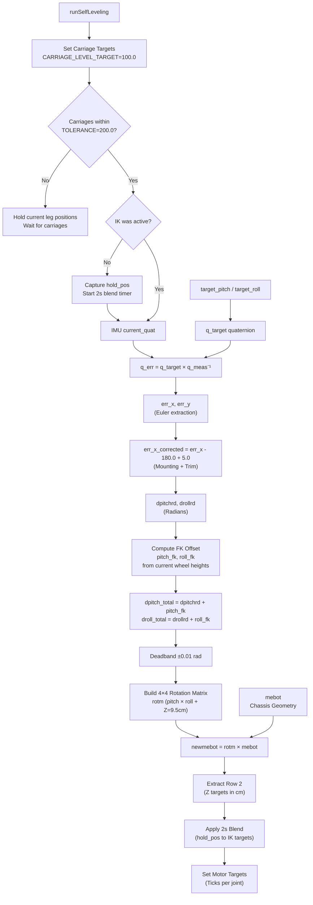

# Self-Leveling Kinematics

The `runSelfLeveling(float dt)` function in `Base.ino` (Lines 105-318, signature at line 113) implements the closed-loop kinematics that keeps the robot chassis horizontal against an inclined surface. It runs each `loop()` cycle when the system is in the `SELF_LEVELING` state.

The algorithm takes the current IMU orientation, computes the angular error to a target (pitch/roll), builds a 3D rotation matrix representing that error, applies it to the robot's chassis geometry, and dispatches the resulting leg height targets to the motor controllers.

______________________________________________________________________

## Overview: What It Solves

The MEBot has independently height-adjustable legs. When the robot is on a slope, these legs can be extended or retracted differentially to keep the chassis parallel to the ground. Self-leveling converts an angular orientation error into a set of target encoder positions for the joints.

______________________________________________________________________

## Step 1 — Carriage Pre-Positioning (Lines 125, 140)

Before the Inverse Kinematics (IK) engages, the carriages must move to a stable baseline position.

```cpp
ml_carriage.setTargetPosition(CARRIAGE_LEVEL_TARGET);
mr_carriage.setTargetPosition(CARRIAGE_LEVEL_TARGET);
```

The IK logic only activates once both carriages are within `CARRIAGE_LEVEL_TOLERANCE` (200.0 ticks) of the `CARRIAGE_LEVEL_TARGET` (100.0 ticks). While waiting, the legs hold their current positions to prevent movement before the geometry is ready.

______________________________________________________________________

## Step 2 — IMU Error Quaternion (Lines 152, 186)

### Getting the Measured Orientation

```cpp
imu::Quaternion q_meas = IMU.current_quat;
```

`current_quat` is the swing quaternion. Yaw has been removed by `IMU_Class::extractSwing()`. This ensures the self-leveling controller only responds to tilt, not to the robot rotating in place.

### Building the Target Quaternion

The target orientation is stored as two float globals, `target_pitch` and `target_roll` (degrees). A target of `pitch=0, roll=0` means perfectly level.

```cpp
double p_rad = (target_pitch * PI / 180.0) / 2.0;
imu::Quaternion q_target_pitch(cos(p_rad), sin(p_rad), 0.0, 0.0);

double r_rad = (target_roll * PI / 180.0) / 2.0;
imu::Quaternion q_target_roll(cos(r_rad), 0.0, sin(r_rad), 0.0);

imu::Quaternion q_target = q_target_pitch * q_target_roll;
```

### Computing the Error Quaternion

```cpp
imu::Quaternion q_err = q_target * q_meas.conjugate();
```

Multiplying `q_target` by the inverse of `q_meas` gives the rotation required to go from the current orientation to the target orientation.

### Extracting Error Angles (Lines 171, 193)

The error quaternion is converted back to pitch and roll angles. Because the IMU is mounted upside down, the Roll axis has a 180 degree physical offset.

```cpp
double err_x = atan2(sinr_cosp, cosr_cosp) * (180.0 / PI); // Roll error
double err_y = asin(sinp) * (180.0 / PI);                  // Pitch error

float err_x_corrected = err_x - 180.0f + PITCH_TRIM_DEG;
if (err_x_corrected < -180.0f) err_x_corrected += 360.0f;
```

`PITCH_TRIM_DEG` (5.0 degrees) is added to the roll error to correct for mounting misalignment. The resulting angles are converted to radians:

```cpp
float dpitchrd = err_x_corrected / DG; // BNO X = Robot Pitch
float drollrd = err_y / DG;            // BNO Y = Robot Roll
```

A deadband of 0.01 rad (approx 0.57 degrees) prevents jitter when the error is near zero.

______________________________________________________________________

## Step 3 — Forward Kinematics Offset (Lines 201, 225)

The controller computes the pitch and roll that the current wheel heights impose on the chassis geometry. This FK offset is added to the IMU error. Without it, the controller would command all legs to a uniform baseline when the IMU error reaches zero, which would undo the slope correction.

The linearized derivation from the mebot geometry matrix:

```cpp
float z_cur_ml = ml.current_pos / ML_CM_TO_TICKS;
float z_cur_rc = rc.current_pos / RC_CM_TO_TICKS;
float z_cur_mr = mr.current_pos / MR_CM_TO_TICKS;

float pitch_fk = -((z_cur_ml + z_cur_mr) / 2.0f - z_cur_rc) / 68.0f;
float roll_fk = (z_cur_mr - z_cur_ml) / 62.0f;

float dpitch_total = dpitchrd + pitch_fk;
float droll_total = drollrd + roll_fk;
```

______________________________________________________________________

## Step 4 — Rotation Matrix Construction (Lines 250, 270)

The total pitch and roll errors are composed into a 4x4 homogeneous rotation matrix:

```cpp
rotm[0][0] = cos(dpitch_total);
rotm[0][2] = sin(dpitch_total);
rotm[1][0] = sin(droll_total) * sin(dpitch_total);
rotm[1][1] = cos(droll_total);
rotm[1][2] = -1 * sin(droll_total) * cos(dpitch_total);
rotm[2][0] = -1 * cos(droll_total) * sin(dpitch_total);
rotm[2][1] = sin(droll_total);
rotm[2][2] = cos(droll_total) * cos(dpitch_total);
rotm[2][3] = 9.5; // Baseline Z height (cm)
```

`Z = 9.5` is the nominal chassis height above ground.

______________________________________________________________________

## Step 5 — Matrix Multiplication (Lines 272, 289)

The `mebot` matrix encodes the physical (X, Y) positions of the leg contact points in centimeters:

```cpp
double mebot[4][4] = {
    {-34, 34, 34, -34}, // X
    {-31, -11, 11, 31}, // Y
    {0, 0, 0, 0},       // Z
    {1, 1, 1, 1}        // Homogeneous
};
```

`newmebot = rotm × mebot` applies the rotation to each leg's position. Row 2 of the result gives the required Z height for each contact point.

______________________________________________________________________

## Step 6 — Target Extraction and Blending (Lines 291, 310)

The Z targets (cm) are extracted and converted to encoder ticks using per-joint constants:

```cpp
float ik_ml = z_target_ml * ML_CM_TO_TICKS;
float ik_mr = z_target_mr * MR_CM_TO_TICKS;
float ik_rc = z_target_rc * RC_CM_TO_TICKS;
float ik_fc = FC_MAX_TICKS;
```

To prevent violent jerks when IK first engages, the system blends from the initial hold positions to the IK targets over a 2 second period (`LEVEL_BLEND_MS = 2000`):

```cpp
float blend = min(1.0f, (float)(millis() - blend_start) / (float)LEVEL_BLEND_MS);

ml.setTargetPosition(hold_ml + blend * (ik_ml - hold_ml));
mr.setTargetPosition(hold_mr + blend * (ik_mr - hold_mr));
rc.setTargetPosition(hold_rc + blend * (ik_rc - hold_rc));
fc.setTargetPosition(hold_fc + blend * (ik_fc - hold_fc));
```

______________________________________________________________________

## Full Data Flow



______________________________________________________________________

## Known Limitations and TODOs

| Issue                                 | Location            | Notes                                                                                                                                     |
| ------------------------------------- | ------------------- | ----------------------------------------------------------------------------------------------------------------------------------------- |
| `FC_MAX_TICKS = 0.0f`                 | `Constants.h:28`    | FC is hardcoded to tick value 0. Verify this is the top-of-range for FC's encoder direction.                                              |
| Front caster not included in geometry | `Base.ino:304-309`  | The `mebot` geometry matrix has 4 columns (ML, RC_L, RC_R, MR). FC is not geometrically coupled. Its contribution to leveling is ignored. |
| Per-joint `CM_TO_TICKS` calibration   | `Constants.h:24-26` | ML (~20.1), MR (~21.1), and RC (~36.7) use specific constants. These require periodic validation against physical travel.                 |
