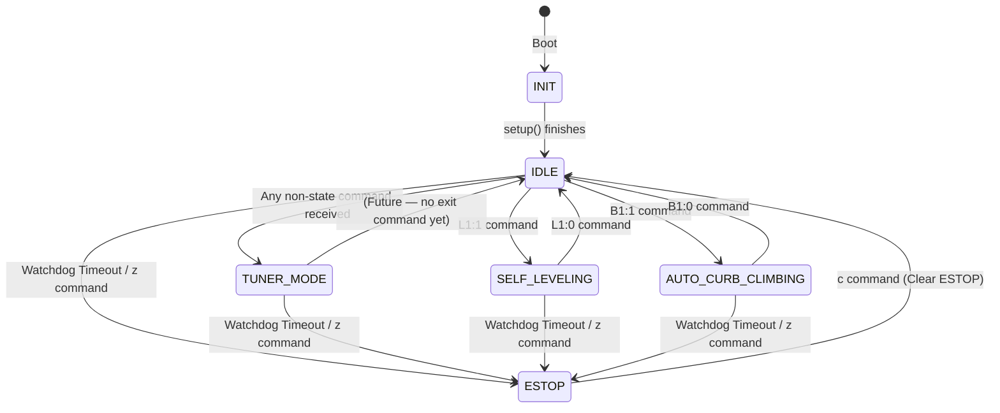

# State Machine

The firmware uses a global `SystemState` enum to ensure the robot never attempts conflicting actions simultaneously.

```cpp
enum SystemState {
  INIT,
  IDLE,
  TUNER_MODE,
  ESTOP,
  SELF_LEVELING,
  CONFIGURATION,
  AUTO_CURB_CLIMBING
};
```

`CONFIGURATION` is reserved for future development and has no dispatch logic in the current firmware. `AUTO_CURB_CLIMBING` is actively implemented via the `SequencePlayer` module.

______________________________________________________________________

## State Transitions



______________________________________________________________________

## State Behaviors

### `INIT` (State 0)

The transient state during `setup()`. The Teensy initializes serial ports (460800 baud), configures limit switch pins, starts the BNO055 IMU, loads all six motor configurations from EEPROM, and restores encoder offsets from saved positions. On completion, the state immediately transitions to `IDLE`. See `Base.ino:314-383`.

### `IDLE` (State 1)

The default resting state. Motors are in whatever mode they were last set to (usually `DISABLED` after boot), waiting for instructions. The watchdog timer is still active in `IDLE` — if no commands arrive for 60 seconds the system will transition to `ESTOP`.

The `IDLE → TUNER_MODE` transition is implicit: any command that is not a mode-change command (`z`, `c`, `L1`, `B1`) and is not `CMD_NONE` will trigger the transition (see `Base.ino:597-601`).

### `TUNER_MODE` (State 2)

The robot is under direct control from the PID Tuner GUI or any serial client. In this state, `Base.ino` delegates all tuning commands (`T`, `M`, `P`, `I`, `D`, `F`, `p`, `i`, `d`, `f`, `l`, `Q`, `q`, `U`, `u`, `n`, `x`, `R`, `H`, `O`, `V`, `E`, `K`, `G`) to the table-driven `dispatchCommand()` function in `src/CommandDispatch/CommandDispatch.cpp`, which routes them to the appropriate `Motor` instance via the `motor_map[]` table.

There is currently **no explicit `TUNER_MODE → IDLE` command** — the state machine comment says `(Future)`. Once in `TUNER_MODE`, the only exits are `ESTOP` or `SELF_LEVELING`.

### `ESTOP` (State 3)

The highest-priority state. All motor activity stops immediately.

**Trigger conditions:**

- Manual: User sends `z` at any time from any state.
- Automatic: `parser.isTimedOut()` returns `true` — no valid serial traffic received for 60 seconds. On watchdog-triggered ESTOP, all 8 motor configs are **auto-saved to EEPROM** if a connection was previously established, preserving the last known positions.

**Action on entry:** All 8 `Motor` instances (including drive wheels) are disabled via `Motor::disable()` which:

- Zeros `target_pwm` and `target_vel`
- Resets `target_pos = current_pos` (prevents jump on re-enable)
- Clears PID integrators and filter state
- Sets mode to `DISABLED`

This runs every `loop()` cycle while in `ESTOP`, so even if a separate path writes to a motor, the ESTOP block in `Base.ino:653-662` immediately re-disables it.

**Exit:** Send `c` (Clear ESTOP). This also calls `parser.feedWatchdog()` to reset the 60-second timer, preventing an immediate re-trigger.

### `SELF_LEVELING` (State 4)

Triggered by `L1:1`. Overrides `TUNER_MODE` if active.

In this state, `Base.ino` calls `runSelfLeveling(dt)` before the `Motor::update()` calls. This function sets all actively controlled motors to `POSITION_CONTROL` and overwrites their targets with geometry-computed values each cycle. Manual `T` commands are still parsed, but since `runSelfLeveling()` calls `setTargetPosition()` on each motor directly, any manually set target is overwritten the next cycle.

Exited by `L1:0`, which falls back to `IDLE`. The next non-special command will then re-enter `TUNER_MODE`.

For full details of the self-leveling kinematics algorithm, see [Self-Leveling Kinematics](SELF_LEVELING.md).

### `CONFIGURATION` (State 5) — Reserved

Defined in the enum but not yet implemented. Intended for a future mode that allows changing system-wide configuration parameters (e.g., geometry constants, serial baud rate) without conflicting with active motor control.

### `AUTO_CURB_CLIMBING` (State 6)

Triggered by `B1:1`. In this state, the `SequencePlayer` module takes control of all 8 motors, executing a sequence of keyframes uploaded from the GUI.

- All 8 motors are placed in `POSITION_CONTROL` on entry via `sequenceEnter()`.
- Each `loop()` cycle calls `sequenceUpdate()` which interpolates targets toward the current keyframe.
- Sequence commands (`J`, `>`, `<`, `@`) are dispatched to `sequenceHandleCommand()`.
- Auto-run mode (`B2:1`) automatically advances to the next keyframe on completion.
- On exit (`B1:0`), `sequenceExit()` restores drive wheels to `VELOCITY_CONTROL`.

For keyframe format details, see [Serial Protocol](../shared/SERIAL_PROTOCOL.md). For full sequence player internals, see `src/SequencePlayer/SequencePlayer.h`.

______________________________________________________________________

## State Machine Implementation in `Base.ino`

The state machine dispatch occupies Lines 535–668 of `Base.ino`. The structure is:

**Lines 536–545** — Watchdog check + auto-save on disconnect. If timeout fires and a connection was previously active, all 8 motor configs are saved to EEPROM before entering ESTOP.

**Lines 547–601** — High-priority state transitions (`z`, `c`, `B1`, `L1`, level pitch/roll, IDLE→TUNER_MODE).

**Lines 603–618** — `CMD_GET_CONFIG` dispatch (safe during any state, including ESTOP).

**Lines 620–644** — TUNER_MODE command dispatch. This block delegates to `dispatchCommand()` via the table-driven `CommandDispatch` module. Handles the special `K0` (save all) case separately.

**Lines 647–650** — AUTO_CURB_CLIMBING command dispatch (delegated to `SequencePlayer`).

**Lines 652–668** — Per-state motor action (`ESTOP` disables all 8; `SELF_LEVELING` calls kinematics; `AUTO_CURB_CLIMBING` calls `sequenceUpdate()`).

**Lines 670–696** — Unconditional `Motor::update(dt)` calls — all 8 motors compute their PID output regardless of state (but `DISABLED` motors return 0 immediately). Drive wheel deadzone logic applied here.

**Lines 698–735** — Limit switch read, PWM override, RoboClaw dispatch.
