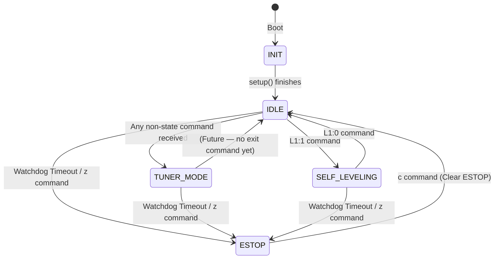

# State Machine

The firmware uses a global `SystemState` enum to ensure the robot never attempts conflicting actions simultaneously.

```cpp
enum SystemState {
  INIT,
  IDLE,
  TUNER_MODE,
  ESTOP,
  SELF_LEVELING,
  CONFIGURATION,
  AUTO_CURB_CLIMBING
};
```

`CONFIGURATION` and `AUTO_CURB_CLIMBING` are reserved for future development and are present in the enum but have no dispatch logic in the current firmware.

---

## State Transitions



---

## State Behaviors

### `INIT` (State 0)

The transient state during `setup()`. The Teensy initializes serial ports (460800 baud), configures limit switch pins, starts the BNO055 IMU, loads all six motor configurations from EEPROM, and restores encoder offsets from saved positions. On completion, the state immediately transitions to `IDLE`. See `Base.ino:314-383`.

### `IDLE` (State 1)

The default resting state. Motors are in whatever mode they were last set to (usually `DISABLED` after boot), waiting for instructions. The watchdog timer is still active in `IDLE` — if no commands arrive for 60 seconds the system will transition to `ESTOP`.

The `IDLE → TUNER_MODE` transition is implicit: any command that is not a mode-change command (`z`, `c`, `L1`) and is not `CMD_NONE` will trigger the transition (see `Base.ino:445-449`).

### `TUNER_MODE` (State 2)

The robot is under direct control from the PID Tuner GUI or any serial client. In this state, `Base.ino` processes all tuning commands (`T`, `M`, `P`, `I`, `D`, `F`, `p`, `i`, `d`, `f`, `l`, `Q`, `q`, `n`, `x`, `R`, `H`, `V`, `E`, `K`, `G`) and routes them to the appropriate `Motor` instance.

There is currently **no explicit `TUNER_MODE → IDLE` command** — the state machine comment says `(Future)`. Once in `TUNER_MODE`, the only exits are `ESTOP` or `SELF_LEVELING`.

### `ESTOP` (State 3)

The highest-priority state. All motor activity stops immediately.

**Trigger conditions:**
- Manual: User sends `z` at any time from any state.
- Automatic: `parser.isTimedOut()` returns `true` — no valid serial traffic received for 60 seconds.

**Action on entry:** All 6 `Motor` instances are disabled via `Motor::disable()` which:
- Zeros `target_pwm` and `target_vel`
- Resets `target_pos = current_pos` (prevents jump on re-enable)
- Clears PID integrators and filter state
- Sets mode to `DISABLED`

This runs every `loop()` cycle while in `ESTOP`, so even if a separate path writes to a motor, the ESTOP block in `Base.ino:710-717` immediately re-disables it.

**Exit:** Send `c` (Clear ESTOP). This also calls `parser.feedWatchdog()` to reset the 60-second timer, preventing an immediate re-trigger.

### `SELF_LEVELING` (State 4)

Triggered by `L1:1`. Overrides `TUNER_MODE` if active.

In this state, `Base.ino` calls `runSelfLeveling(dt)` before the `Motor::update()` calls. This function sets all actively controlled motors to `POSITION_CONTROL` and overwrites their targets with geometry-computed values each cycle. Manual `T` commands are still parsed, but since `runSelfLeveling()` calls `setTargetPosition()` on each motor directly, any manually set target is overwritten the next cycle.

Exited by `L1:0`, which falls back to `IDLE`. The next non-special command will then re-enter `TUNER_MODE`.

For full details of the self-leveling kinematics algorithm, see [Self-Leveling Kinematics](SELF_LEVELING.md).

### `CONFIGURATION` (State 5) — Reserved

Defined in the enum but not yet implemented. Intended for a future mode that allows changing system-wide configuration parameters (e.g., geometry constants, serial baud rate) without conflicting with active motor control.

### `AUTO_CURB_CLIMBING` (State 6) — Reserved

Defined in the enum but not yet implemented. Intended for a future autonomous behavior that sequences the leg actuators to climb over a curb using the IMU and limit switches as feedback.

---

## State Machine Implementation in `Base.ino`

The state machine dispatch occupies Lines 414–706 of `Base.ino`. The structure is:

**Lines 414–449** — Watchdog check + high-priority state transitions (`z`, `c`, `L1:x`, IDLE→TUNER_MODE)

**Lines 452–706** — TUNER_MODE command dispatch. This block only executes when `current_state == TUNER_MODE`. It handles the special `K0` (save all) case first, then routes to the appropriate `Motor*` pointer and processes the command type via a nested `switch`.

**Lines 710–720** — Per-state motor action (`ESTOP` disables all; `SELF_LEVELING` calls kinematics)

**Lines 722–727** — Unconditional `Motor::update(dt)` calls — all 6 motors compute their PID output regardless of state (but `DISABLED` motors return 0 immediately)

**Lines 730–783** — Limit switch read, PWM override, RoboClaw dispatch
