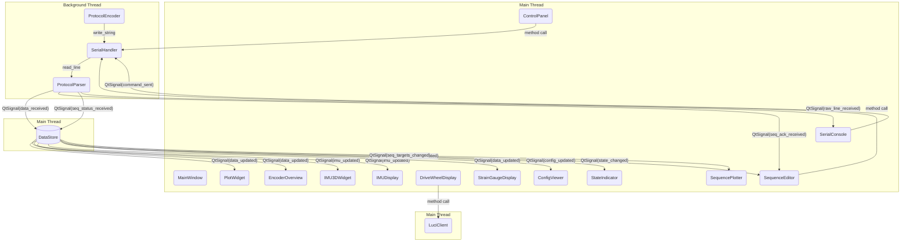

# PID Tuner Architecture

The application is structured to strictly decouple the Serial I/O thread, the Data caching layer, and the User Interface thread. Communication across these boundaries is achieved safely using PyQt Signals and Slots.

## Component Flowchart

## Design Principles

1. **Thread Safety via Signals:** The `SerialHandler` lives in a `QThread`. It never touches UI elements directly. It emits `data_received(EncoderData)` which is queued to the Main Thread where `DataStore` ingests it.
1. **Centralized State:** `DataStore` acts as the single source of truth for all 8 joints. UI components (`PlotWidget`, `ControlPanel`) read from `DataStore` rather than caching their own copies of the robot state.
1. **Decoupled UI:** The `MainWindow` instantiates the UI components, passing them references to `DataStore` and `SerialHandler`. Components hook up to the signals they care about.
