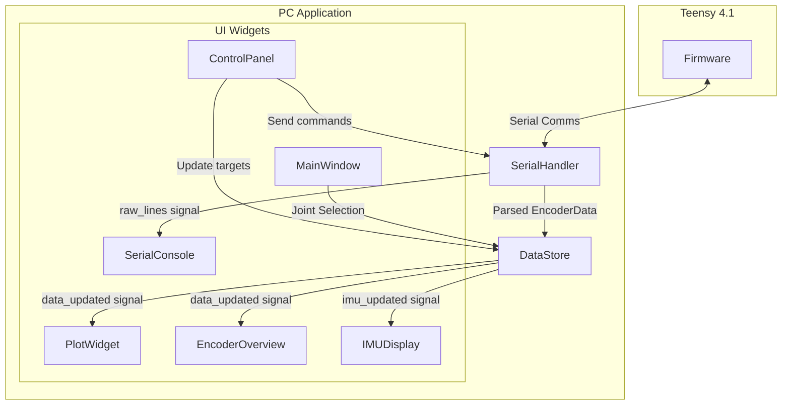

# PID Tuner for Teensy 4.1

A PyQt6-based GUI application for tuning PID controllers running on Teensy 4.1 microcontrollers. Designed for MEBot/RAMMP robots with 12 encoder-driven joints.

## Features

- **Real-time plotting** of encoder position, velocity, and PWM vs target
- **Target controls**: Set absolute targets, timed step inputs (+/-), quick step buttons
- **Sine wave generator**: Configurable amplitude, frequency, and duration for testing
- **IMU tracking**: Live readouts and plots of Pitch, Roll, Yaw, and Acceleration
- **Simulation mode**: Preview target signals without hardware connected
- **Serial console**: View raw serial data stream

## Architecture

The application is structured to decouple serial communication from the UI using Qt signals and a central `DataStore`.



## Installation

We recommend using [uv](https://github.com/astral-sh/uv) for fast, reliable Python environment management.

### Install uv (if not already installed)

```bash
# macOS/Linux
curl -LsSf https://astral.sh/uv/install.sh | sh

# Or with Homebrew
brew install uv
```

### Set up the project

```bash
cd pid_tuner

# Create a virtual environment and install dependencies
uv venv
source .venv/bin/activate  # On Windows: .venv\Scripts\activate
uv pip install -r requirements.txt
```

### Dependencies

- Python 3.8+
- PyQt6
- pyqtgraph
- pyserial
- numpy

## Usage

### Running the Application

```bash
# Make sure your venv is activated
source .venv/bin/activate  # On Windows: .venv\Scripts\activate

python run.py
```

Or run directly with uv (no activation needed):

```bash
uv run python run.py
```

### Connecting to Teensy

1. Select the serial port from the dropdown (click "Refresh" to update)
1. Select baud rate (default: 115200)
1. Click "Connect"

### Using Simulation Mode

To preview target signals before connecting to hardware:

1. Click the **"Simulate"** button in the plot toolbar (turns green when active)
1. Set targets or start a sine wave - they will be plotted in real-time
1. Simulation mode auto-disables when you connect to a real device

### Controls

| Control            | Description                                                         |
| ------------------ | ------------------------------------------------------------------- |
| **Set Target**     | Send an absolute target for the selected joint                       |
| **Use Current**    | Copy current encoder position to target input                       |
| **Set Zero**       | Set target to 0                                                     |
| **Home Position**  | Send 'H' command to zero the encoder                                |
| **Flip Dir**       | Send 'V' command to flip motor direction (saved to EEPROM)          |
| **Disable Motors** | Send 'z' command to disable all motors (ESTOP)                      |
| **Step +/-**       | Execute a timed step of configured amplitude and duration           |
| **Quick Steps**    | One-click buttons for quick percentage-based steps                  |
| **Start Sine**     | Begin sine wave oscillation around current target                   |
| **Stop Sine**      | Stop sine wave and return to center position                        |

## Serial Protocol

### Teensy -> PC: Encoder Data

The Teensy outputs telemetry data at ~10Hz or higher in this format (34 values):

```
TELEMETRY,<timestamp_ms>,<state>,<6 pos>,<6 vel>,<6 pwm>,<6 dirs>,<4 limits>,<6 imu>\n
```

### PC -> Teensy: Commands

| Command    | Format          | Example   | Description                                                    |
| ---------- | --------------- | --------- | -------------------------------------------------------------- |
| Target     | `T<id>:<val>\n` | `T1:1500` | Set target for joint 1                                         |
| Mode       | `M<id>:<val>\n` | `M1:2`    | Set mode (0:Open Loop, 1:Vel, 2:Pos)                           |
| PID Config | `P<id>:<val>\n` | `P1:0.5`  | Set Pos KP (`P`, `I`, `D`, `F`) or Vel KP (`p`, `i`, `d`, `f`) |
| Home       | `H<id>\n`       | `H1`      | Zero the encoder                                               |
| Direction  | `V<id>\n`       | `V1`      | Toggle motor direction                                         |
| Reset      | `R<id>\n`       | `R1`      | Clear integrator windup                                        |
| Disable    | `z\n`           | `z`       | Emergency stop (disable all)                                   |
| Clear      | `c\n`           | `c`       | Clear emergency stop                                           |
